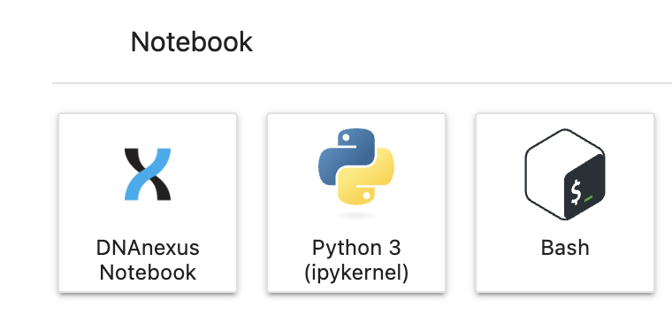
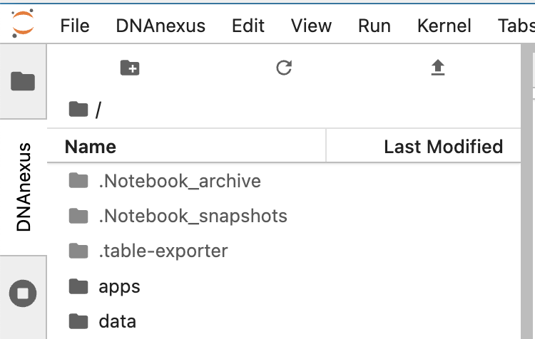
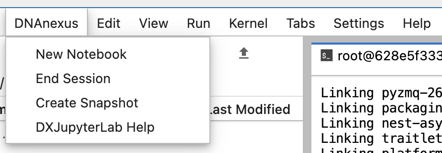
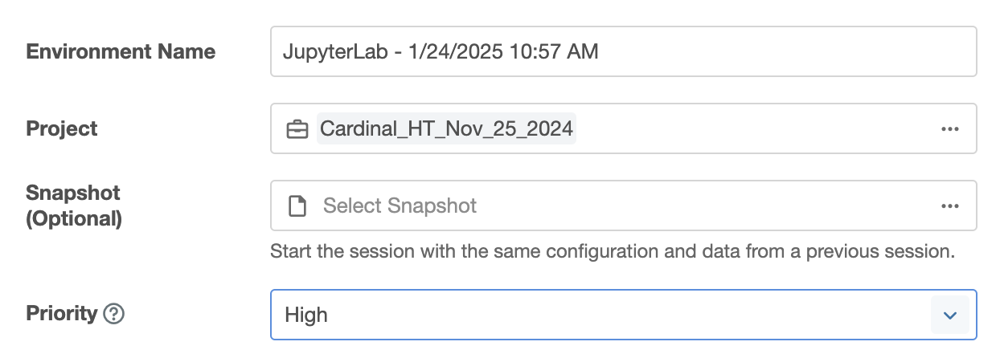

# Use Jupyter Notebooks in the RAP

- [Use Jupyter Notebooks in the RAP](#use-jupyter-notebooks-in-the-rap)
	- [Main concepts - READ THIS!](#main-concepts---read-this)
		- [Regular or DNAnexus notebooks](#regular-or-dnanexus-notebooks)
		- [Access your project files](#access-your-project-files)
		- [Save your work - IMPORTANT!!](#save-your-work---important)
	- [Manage packages in the JupyterLab session](#manage-packages-in-the-jupyterlab-session)
		- [Setup micromamba and envs space](#setup-micromamba-and-envs-space)
		- [Make environments available in JupyterLab](#make-environments-available-in-jupyterlab)
	- [Create a snapshot of the environment](#create-a-snapshot-of-the-environment)

## Main concepts - READ THIS!

To start a Jupyter Notebook session in the RAP you can simply select JupyterLab from the tools menu and then start a new seesion with the desired machine according to the resource yoy need (CPU, memory, etc).

By default the jupyter lab session starts on a empty machine, but you have full admin acces so you can easily install new packages on the terminal using `pip` or `conda`.

The `dx` tool is also available in the JupyterLab session, so you can use it to interact with the RAP to upload/download files for example.

The default notebook location is `/opt/notebooks`, these files are not persistent thus you need to manually upload them to your project (`dx upload`) if you need to keep them after the end of the session. 

In general, all the changes made during a session, including new environments, will be lost when you close the session. Install new packages in the session is quite fast (see the [manage packages section](#manage-packages-in-the-jupyterlab-session)) thus it can be repeated for each session. However, if you have to configure a complex environment, you can save the configured machine using a snapshot (see [the snapshot section](#create-a-snapshot-of-the-environment)).

### Regular or DNAnexus notebooks

When you generate a new notebook from the JupyterLab interface, the notebook is stored in the VM in the `/opt/notebooks` folder and will be lost when you close the session.

You can generate notebooks directly in your project space if you create them as `DNANexus notebooks` from the DNAnexus menu. These notebooks will be stored in the current project folder in your project space (you can navigate your project space in the `DNANexus` tab in the file manager). Even in this case, any file saved from Notebook code (for example `df.to_csv`) will go in the `/opt/notebooks` folder and will be lost when you close the session. See the [save your work section](#save-your-work---important) for more details.



Keep in mind that a copy of DNANexus notebooks is also stored in `.Notebook_archive` in the project space, so you can recover the notebook from there, but you also need to clean this space from time to time to avoid excessive storage costs.

### Access your project files

- Files from your project are available read-only in `/mnt/project` and you can navigate your project space in the `DNANexus` tab in the JupyterLab file manager
- To access files from an external project you can use the `dx` tool.



For example you can explore files in another project like this:

```bash
# Move to the project
dx select

# List files in the project
dx ls
```

Or you can copy a file from another project to a folder of your interes if you already know the path and project id. You can get the project from the RAP interface in the project settings.

```bash
# Move to the target local folder where you want to store the data
cd /my/data/folder

# Copy the file from the project
dx download project-xxxx:/path/to/file
```

### Save your work - IMPORTANT!!

All new files generated during the session will be lost when you close the jupyterLab session. To save your work you need to manually upload the files to your project space using `dx upload`. You can use the `-d` flag to specify the destination folder in the project, otherwise the files will be uploaded in the current working directory of the project (use `dx pwd` to see where you are in the project tree).

```bash
# Move to the folder where you have the files
cd /my/data/folder

# Upload the files to the project
dx upload file1 file2 -d /my/destination/folder

# Or upload all files in a folder
dx upload /my/path/* -d /my/destination/folder
```

## Manage packages in the JupyterLab session

**NB**: New conda envs and packages are installed in the JupyterLab session, so you need to repeat the process if you start a new session. You can make changes persistent using a snapshot of the environment (see [the snapshot section](#create-a-snapshot-of-the-environment)).

### Setup micromamba and envs space

You can install new packages in the JupyterLab session using `pip` or `conda`, but our suggestion is to install `micromamba` to make the process faster and more reliable.

```bash
# Install micromamba
wget https://github.com/mamba-org/micromamba-releases/releases/download/2.0.2-2/micromamba-linux-64 -O /usr/bin/micromamba
chmod a+x /usr/bin/micromamba
```

Then create a folder in the system tree where you can store the environments, for example `/conda_root` and set the `MAMBA_ROOT_PREFIX` to this folder. In this way named environments will be stored in `$MAMBA_ROOT_PREFIX/envs` and you can easily switch between them.

```bash
mkdir /conda_root
export MAMBA_ROOT_PREFIX=/conda_root
micromamba shell init --shell bash 
```

You can then create environments and install packages similarly to conda. Use `-c` to specify the channel where to look for the packages.

```bash
# Create a new environment
micromamba create -c conda-forge -n myenv pkg1 pkg2

# Create and env and specify teh exact env location
micromamba create -c conda-forge --prefix /path/to/env pkg1 pkg2

# Activate the environment
micromamba activate myenv

# Install new packages in the environment
micromamba install -c conda-forge pkg3 pkg4
```

The most convenient way to manages conda envs is to create `yml` file describing your environment and store them in a dedicated folder in you RAP project. Then you can use these files to recreate the environment in the JupyterLab session since they will be readable from the `/mnt/project` folder.

```bash
# Create the environment using the yml file
micromamba env create -n mynewenv -f /mnt/project/path/to/env.yml
```

### Make environments available in JupyterLab

First, always remember to install the `ipykernel` package in the environment you want to use in JupyterLab. This package is required to make the environment available in the JupyterLab interface.

Then you can install the kernel in the JupyterLab session using the following command:

```bash
# Activate the environment
micromamba activate myenv

# Install the kernel
python -m ipykernel install \
	--name python-my-env \
	--display-name 'nice name for the env'
```

It may take a moment for the JupyterLab interface to update the list of available kernels, but you should see the new kernel available in the list when you create a new notebook or change the kernel of an existing one.

## Create a snapshot of the environment

Once you configured your environment with all the packages you need, you may want to create a snapshot of the environment to make it persistent and available in the future. This is suggested only when you have a complex environment that takes a long time to configure and build from scratch.

Main steps suggested to create a snapshot:

1. Start a new clean JupyterLab session
2. Configure micromamba and the environment(s) you need. Do not use the home folder to store envs since this is not saved in the snapshot
3. Create a snapshot from the main menu `DNAnexus > Create snapshot`. Create a snapshot BEFORE doing any real work, so that the snapshot will be clean and you can use it as a base for future sessions.



Keep in mind that the process takes a while and the JupyterLab session can become unresponsive during the snapshot creation.

The snapshot will be stored in the current project folder in the `.Notebook_snapshot` folder. Once the snapshot file is created, you can rename it to something more meaningful and eventually move it to a dedicated folder in your project space.

You can then load the snapshot when you start a new session using the dedicate input box.


